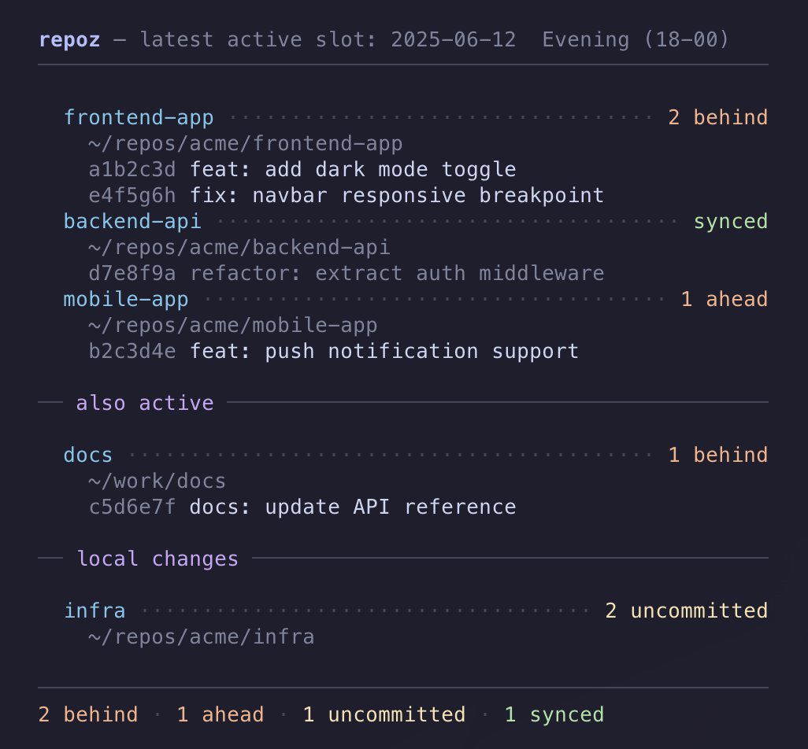

# repoz


See what changed across your repos since you last sat down.

If you work on multiple projects and switch between machines — a work laptop and a home setup, say — you know the feeling. You sit down, and you're not sure which repos have new commits you need to pull, which ones you forgot to push last night, or where you left uncommitted work.

repoz gives you that overview in one command. It checks GitHub, compares with what you have locally, and shows you the status of everything that's been active recently — commits behind, ahead, uncommitted changes, and untracked files. That's it. No setup, no config files, no background processes. Just a bash script, `gh`, and `jq`.

It's fast because it doesn't check every repo you own — it asks GitHub which repos were recently pushed to, then only fetches those.

---

## Requirements

- **bash** — already on macOS and Linux
- **git** — already on most systems; if not: [git-scm.com](https://git-scm.com)
- **gh** — GitHub CLI: [cli.github.com](https://cli.github.com)
- **jq** — JSON processor: `brew install jq` / `apt install jq` / [jqlang.github.io](https://jqlang.github.io/jq/)

---

## Installation

**1. Authenticate with GitHub**

repoz uses the GitHub CLI to talk to GitHub. If you haven't set it up yet:

```sh
gh auth login
```

Follow the prompts — it'll open a browser and handle everything. You only need to do this once.

**2. Install repoz**

```sh
git clone https://github.com/Gaurgle/repoz.git
cd repoz
./install.sh
```

This copies repoz to `~/.local/bin/` and checks that dependencies are present. To install elsewhere:

```sh
./install.sh /usr/local/bin
```

Or just copy it manually:

```sh
cp repoz ~/.local/bin/repoz
chmod +x ~/.local/bin/repoz
```

---

## Usage

```sh
repoz [options]
```

| Flag | Description |
|------|-------------|
| *(default)* | Find the latest time slot with activity and show those repos |
| `--since DATE` | Show all activity since DATE (e.g. `2026-03-15`) |
| `--today` | Show all activity since midnight |
| `--all` | Show all divergence, no time filter |
| `-h, --help` | Show help |

By default, repoz searches for local clones under the current directory. Set `REPO_CHECK_DIR` to search somewhere specific:

```sh
REPO_CHECK_DIR=~/code repoz
```

---

## Output


```
repoz — latest active slot: 2026-03-31  Evening (18-00)
──────────────────────────────────────────────────────────

  frontend-app ·································· 2 behind
    ~/repos/acme/frontend-app
    a1b2c3d feat: add dark mode toggle
    e4f5g6h fix: navbar responsive breakpoint
  backend-api ························ 3 uncommitted
    ~/repos/acme/backend-api
    d7e8f9a refactor: extract auth middleware
  mobile-app ··················· 1 ahead, 2 uncommitted
    ~/repos/acme/mobile-app
    b2c3d4e feat: push notification support

── also active ───────────────────────────────────────────

  docs ·········································· 1 behind
    ~/work/docs
    c5d6e7f docs: update API reference

── local changes ─────────────────────────────────────────

  infra ···································· 2 uncommitted
    ~/repos/acme/infra

──────────────────────────────────────────────────────────
1 behind · 1 ahead · 2 uncommitted
```

| Section | What it shows |
|---------|---------------|
| Main list | Repos with GitHub activity found under your search directory |
| Also active | Same repos found in other locations on your machine |
| Local changes | Repos with uncommitted or untracked files, even if there was no recent GitHub activity |

---

## Configuration

Create `~/.config/repoz/config` to customize behavior:

```sh
# Time slot boundaries (24h format)
WORK_START=9
WORK_END=18

# How many repos to fetch from GitHub (default: 50)
REPO_LIMIT=50

# Where to look for local clones (overridden by REPO_CHECK_DIR env var)
REPO_CHECK_DIR=~/repos
```

All settings are optional — without a config file, defaults are used.

The three time slots are derived from `WORK_START` and `WORK_END`:

| Slot | Default | Description |
|------|---------|-------------|
| Work | 09:00 – 18:00 | `WORK_START` to `WORK_END` |
| Evening | 18:00 – 00:00 | `WORK_END` to midnight |
| Night | 00:00 – 09:00 | Midnight to `WORK_START` |

---

## SSH setup

repoz runs `git fetch` on active repos. If your remotes use SSH (`git@github.com:...`), you'll want your key loaded so you don't get passphrase prompts on every fetch.

**macOS** — store your passphrase in the Keychain once:

```sh
ssh-add --apple-use-keychain ~/.ssh/id_rsa
```

Add to `~/.ssh/config`:

```
Host *
  AddKeysToAgent yes
  UseKeychain yes
```

Your private key stays encrypted on disk; the passphrase is stored in the macOS Keychain and unlocked with your login password.

**Linux** — most distros start an ssh-agent automatically. Run `ssh-add` once per session, or configure your desktop keyring to handle it on login.

**Using HTTPS remotes?** `gh auth login` already covers authentication. You can switch a repo to SSH with:

```sh
git remote set-url origin git@github.com:user/repo.git
```

---

Works with personal repos and organization/team repos.

---

## Also

Check out [notez](https://github.com/Gaurgle/notez-cli) — a local-first CLI note-taking tool with interactive todos and project-scoped notes.
