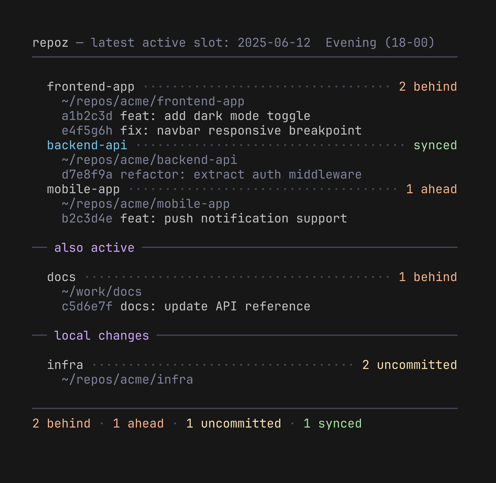

# repoz


See what changed across your repos since you last sat down.

If you work on multiple projects and switch between machines (a work laptop and a home setup, say), you know the feeling. You sit down, and you're not sure which repos have new commits you need to pull, which ones you forgot to push last night, or where you left uncommitted work.

**repoz** gives you that overview in one command. It checks GitHub, compares with what you have locally, and shows you the status of everything that's been active recently: commits behind, ahead, uncommitted changes, and untracked files. That's it. No setup, no config files, no background processes. Just a bash script, `gh`, and `jq`.

It's fast because it doesn't check every repo you own. It asks GitHub which repos were recently pushed to, then fetches them in parallel.

---

## Requirements

- **bash**: already on macOS and Linux
- **git**: already on most systems; if not: [git-scm.com](https://git-scm.com)
- **gh**: GitHub CLI: [cli.github.com](https://cli.github.com)
- **jq**: JSON processor: `brew install jq` / `apt install jq` / [jqlang.github.io](https://jqlang.github.io/jq/)

---

## Installation

**1. Authenticate with GitHub**

**repoz** uses the GitHub CLI to talk to GitHub. If you haven't set it up yet:

```sh
gh auth login
```

Follow the prompts. It'll open a browser and handle everything. You only need to do this once.

**2. Install repoz**

```sh
git clone https://github.com/Gaurgle/repoz.git
cd repoz
./install.sh
```

This copies repoz to `~/.local/bin/` and checks that dependencies are present. To install elsewhere:

```sh
./install.sh /usr/local/bin
```

Or just copy it manually:

```sh
cp repoz ~/.local/bin/repoz
chmod +x ~/.local/bin/repoz
```

---

## Updating

Once installed, keep it current with:

```sh
git -C ~/Repos/repoz pull   # get the latest (you stay in control of this)
repoz --update              # reinstall the pulled version
```

Or combine the two: `repoz --update --pull` runs `git pull --ff-only` in the
clone first, then reinstalls. The fast-forward-only pull never clobbers local
work: if the clone can't fast-forward, it stops and skips the install.

`--update` reads the source from your clone. It looks in `~/Repos/repoz` by
default; if yours lives elsewhere, set `REPOZ_SRC` (env var or in the config
file). Note the first upgrade to a version that has `--update` still needs a
manual `./install.sh` (or `cp`) to bootstrap the flag onto the installed copy.

---

## Usage

```sh
repoz [options]
```

### Modes (pick one)

| Flag | Description |
|------|-------------|
| *(default)* | Find the latest time slot with activity and show those repos |
| `--since DATE` | Show all activity since DATE (e.g. `2026-03-15`, `yesterday`, `3d`, `1w`) |
| `--before DATE` | Only show repos pushed before DATE (same relative formats as `--since`) |
| `-t, --today` | Show all activity since midnight |
| `-a, --all` | Show all divergence, no time filter |
| `-d, --dirty` | Local only, show uncommitted/untracked/unpushed (no GitHub) |

### Options (combinable)

| Flag | Description |
|------|-------------|
| `--author NAME` | Filter displayed commits by author (partial match) |
| `-s, --stat` | Show diff stats per commit (`+42 -17`) |
| `-p, --prs` | Also show open pull requests for each repo |
| `--no-glyphs` | Hide the org/private/public repo-type glyphs |
| `--update` | Reinstall repoz from your local clone (no pull) |
| `--update --pull` | `git pull --ff-only` the clone first, then reinstall |
| `-h, --help` | Show help |

### Examples

```sh
repoz                                    # what changed since I left?
repoz --since 1w                         # last week
repoz -s --since 1w                      # last week with diff stats on all repos
repoz --since 1w --author andreas        # only my commits
repoz --since 1w --before 3d             # last week, excluding last 3 days
repoz -a -p                              # everything + PRs
repoz -d                                 # local dirty repos only
repoz -t                                 # today
```

By default, **repoz** searches for local clones under the current directory. Set `REPO_CHECK_DIR` to search somewhere specific:

```sh
REPO_CHECK_DIR=~/code repoz
```

---

## Output




```
repoz, since 2026-03-31  Evening (18-00)
──────────────────────────────────────────────────────────────────────

  frontend-app ~/repos/acme/frontend-app ··················· 2 behind
    a1b2c3d feat: add dark mode toggle ··········· +18 -3  alice
    e4f5g6h fix: navbar responsive breakpoint ····· +4 -2  bob
  backend-api ~/repos/acme/backend-api ············· 3 uncommitted
    d7e8f9a refactor: extract auth middleware ···· +42 -17  alice
  mobile-app ~/repos/acme/mobile-app ········ 1 ahead, 2 uncommitted
    b2c3d4e feat: push notification support ······ +95 -8  alice

── also active ───────────────────────────────────────────────────────

  docs ~/work/docs ············································ 1 behind
    c5d6e7f docs: update API reference ·················· +12  bob

── local changes ─────────────────────────────────────────────────────

  infra ~/repos/acme/infra ···························· 2 uncommitted

──────────────────────────────────────────────────────────────────────
2 behind · 1 ahead · 2 uncommitted · 1 synced
```

| Section | What it shows |
|---------|---------------|
| Main list | Repos with GitHub activity found under your search directory |
| Also active | Same repos found in other locations on your machine |
| Local changes | Repos with uncommitted or untracked files, even if there was no recent GitHub activity |

Each commit line shows the author name. When a repo has divergence (behind, ahead, or uncommitted), diff stats (`+lines -lines`) are shown automatically. Use `-s` to force diff stats on synced repos too.

A Nerd Font glyph before each repo name marks its type (a legend is printed in the summary footer):

| Glyph | Meaning |
|-------|---------|
|  (building, mauve) | Repo owned by an organization |
|  (lock, peach) | Personal **private** repo |
|  (globe, green) | Personal **public** repo |

Glyphs need a [Nerd Font](https://www.nerdfonts.com/). Disable them with `--no-glyphs`, or override the characters/toggle in the config file. Repos with no GitHub metadata (local-only, in the "local changes" section) show no glyph.

Repos stuck mid-operation (merge, rebase, cherry-pick, revert, bisect) are
flagged in red, e.g. `rebasing, 2 uncommitted`, and counted as
`N in progress` in the summary.

Stashes count as forgotten work: a repo with stashed changes shows
`N stashed` (mauve) even when otherwise clean, and the summary totals them.

The output width adapts to your terminal size.

---

## Configuration

Create `~/.config/repoz/config` to customize behavior:

```sh
# Time slot boundaries (24h format)
WORK_START=9
WORK_END=18

# How many repos to fetch from GitHub (default: 50)
REPO_LIMIT=50

# Where to look for local clones (overridden by REPO_CHECK_DIR env var)
REPO_CHECK_DIR=~/repos

# Where 'repoz --update' reads the source from (default: ~/Repos/repoz)
REPOZ_SRC=~/Repos/repoz

# Repo-type glyphs (need a Nerd Font). Set SHOW_GLYPHS=false to hide them,
# or override any glyph with your own character.
SHOW_GLYPHS=true
GLYPH_ORG=
GLYPH_PRIVATE=
GLYPH_PUBLIC=
```

All settings are optional. Without a config file, defaults are used.

The three time slots are derived from `WORK_START` and `WORK_END`:

| Slot | Default | Description |
|------|---------|-------------|
| Work | 09:00 – 18:00 | `WORK_START` to `WORK_END` |
| Evening | 18:00 – 00:00 | `WORK_END` to midnight |
| Night | 00:00 – 09:00 | Midnight to `WORK_START` |

---

## SSH setup

**repoz** runs `git fetch` on active repos. If your remotes use SSH (`git@github.com:...`), you'll want your key loaded so you don't get passphrase prompts on every fetch.

repoz never prompts mid-run: fetches run with prompts disabled and fail
quietly for repos that would need interactive auth. If a repo stops showing
behind counts, fetch it manually once to refresh credentials.

**macOS**: store your passphrase in the Keychain once:

```sh
ssh-add --apple-use-keychain ~/.ssh/id_rsa
```

Add to `~/.ssh/config`:

```
Host *
  AddKeysToAgent yes
  UseKeychain yes
```

Your private key stays encrypted on disk; the passphrase is stored in the macOS Keychain and unlocked with your login password.

**Linux**: most distros start an ssh-agent automatically. Run `ssh-add` once per session, or configure your desktop keyring to handle it on login.

**Using HTTPS remotes?** `gh auth login` already covers authentication. You can switch a repo to SSH with:

```sh
git remote set-url origin git@github.com:user/repo.git
```

---

Works with personal repos and organization/team repos.

---

## Also

Check out [notez](https://github.com/Gaurgle/notez-cli), a local-first CLI note-taking tool with interactive todos and project-scoped notes.
